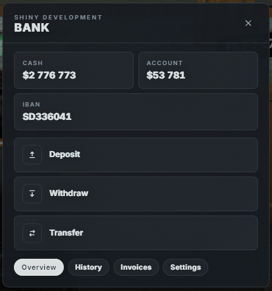
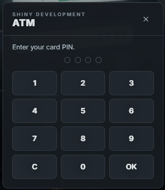

# Shiny Banking

Bank and ATM for ESX. Players deposit, withdraw and transfer money by IBAN, pay unpaid invoices, and manage a society account from a boss rank.

## Preview

<p align="center">
  
  
</p>

## Features

- Bank UI: cash, account, IBAN, deposit, withdraw, transfer
- ATM UI with a 4-digit PIN pad
- First PIN is set for free at a bank; later PIN changes are paid
- Transaction history (deposits, withdrawals, transfers)
- Unpaid invoices tab when `shiny-billing` is running
- Society deposit / withdraw for configured jobs and boss ranks
- Settings: custom IBAN, PIN, optional credit card for ATMs
- ox_target on bank locations and ATM props, plus map blips
- Notifications via `lation_ui`, `ox_lib`, or ESX

## Dependencies

| Resource | Required |
| --- | --- |
| [es_extended](https://github.com/esx-framework/esx_core) | Yes |
| [oxmysql](https://github.com/overextended/oxmysql) | Yes |
| [ox_target](https://github.com/overextended/ox_target) | Yes if `Config.UseTarget` |
| [shiny-billing](../shiny-billing) | Optional (Invoices tab) |
| [ox_lib](https://github.com/overextended/ox_lib) | Optional (notifications) |
| [lation_ui](https://lationscripts.com/) | Optional (notifications) |

Notification order: `lation_ui` → `ox_lib` (`lib.notify`) → `ESX.ShowNotification`.

Stop `okokBanking` (or any other banking resource) so targets and IBANs do not clash.

## Installation

1. Drop the folder into `resources` as `shiny-banking`.
2. Tables and `users.iban` / `users.pincode` columns are created automatically on start. You can also import `sql/shiny-banking.sql` manually (user columns are still added by `server/db.lua`).
3. Add to `server.cfg`:

```cfg
ensure oxmysql
ensure es_extended
ensure ox_target
ensure shiny-banking
```

4. Edit `config.lua` (IBAN prefix, societies, ATM card, webhook).
5. Restart the server (or `ensure shiny-banking` after the database is ready).
6. Reconnect after UI changes so the NUI cache reloads.

## Usage

### Bank

Use ox_target **Bank** at a bank marker.

| Tab | What it does |
| --- | --- |
| Overview | Deposit, withdraw, transfer to another IBAN |
| History | Personal transaction list |
| Invoices | Unpaid invoices from `shiny-billing` (bank only) |
| Society | Job account, shown only for allowed ranks |
| Settings | Change IBAN / PIN (paid after the first PIN), buy a credit card |

### ATM

Use ox_target **ATM** on an ATM prop.

- Needs a PIN. If none is set, the player must open a bank first.
- Optional credit card item when `Config.RequireCreditCardForATM` is `true`.
- No society tab and no settings.

## Configuration

All options live in `config.lua`.

| Option | Default | Description |
| --- | --- | --- |
| `Config.Locale` | `esx:locale` / `en` | Language pack from `locales/` |
| `Config.IBANPrefix` | `SD` | Prefix before the generated digits |
| `Config.IBANNumbers` | `6` | Digit count after the prefix |
| `Config.CustomIBANMaxChars` | `10` | Max length of a custom IBAN |
| `Config.CustomIBANAllowLetters` | `true` | Letters allowed in a custom IBAN |
| `Config.IBANChangeCost` | `5000` | Cost to change IBAN |
| `Config.PINChangeCost` | `1000` | Cost to change PIN after the first one |
| `Config.MaxAmount` | `10000000` | Max amount per action |
| `Config.UseAddonAccount` | `true` | Use ESX addon accounts for societies |
| `Config.RequireCreditCardForATM` | `false` | ATM requires `Config.CreditCardItem` |
| `Config.CreditCardItem` | `creditcard` | Item name for the card |
| `Config.CreditCardPrice` | `100` | Price to buy a card in Settings |
| `Config.UseTarget` | `true` | ox_target on banks and ATMs |
| `Config.TargetDistance` | `1.5` | Bank target distance |
| `Config.ATMDistance` | `1.5` | ATM target distance |
| `Config.ShowBankBlips` | `true` | Map blips for bank locations |
| `Config.Societies` | `police`, `ambulance` | Jobs with a society tab |
| `Config.SocietyAccessRanks` | `boss`, `chief` | Grades that can open the society tab |
| `Config.ATMModels` | Fleeca / standard ATMs | Prop hashes for ATM targets |
| `Config.BankLocations` | Los Santos / Blaine | Bank coords, blip sprite, color, label |
| `Config.Webhook` | empty / your URL | Optional Discord log for transfers |

UI strings are in `locales/en.lua` under `ui`.

## Locale

English strings are in `locales/en.lua`. `Config.Locale` follows the `esx:locale` convar and falls back to `en`.

To add a language, copy `locales/en.lua`, change the pack key (for example `Locales['de']`), and set `Config.Locale` or `esx:locale` to that key.

## Exports

Server-side, for other resources (billing, jobs, etc.):

```lua
exports['shiny-banking']:AddMoney(society, amount)
exports['shiny-banking']:RemoveMoney(society, amount)
exports['shiny-banking']:GetAccount(society)
exports['shiny-banking']:AddTransaction(senderIdent, senderName, receiverIdent, receiverName, amount, type)
```

`society` is a job name such as `police`. Money is added to `society_police` when addon accounts are enabled.

There is also a net event `shiny-banking:AddNewTransaction` with the same fields as okokBanking-style logs.

## Database

Created automatically by `server/db.lua`:

- `users.iban` — personal IBAN
- `users.pincode` — ATM / card PIN
- `shiny_banking_transactions` — deposit, withdraw, transfer history
- `shiny_banking_societies` — society IBAN map

## License

Private resource — Shiny Development.
